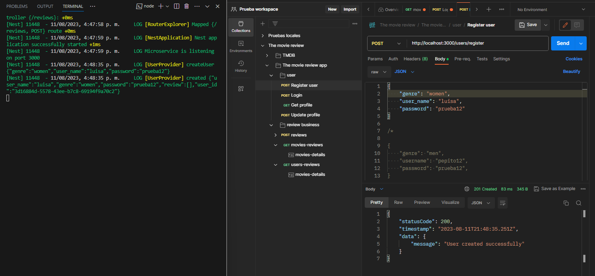
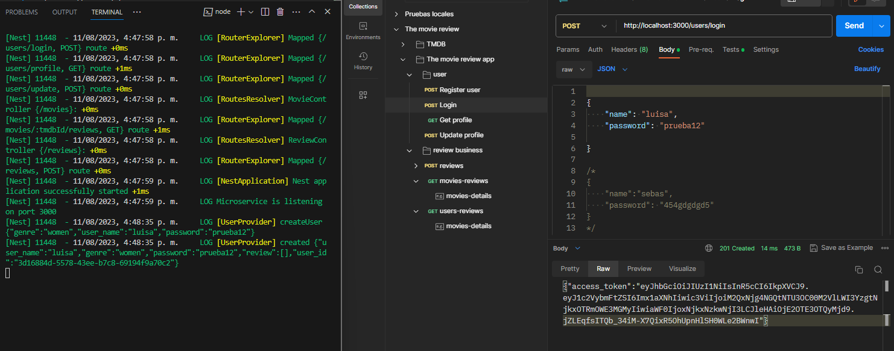
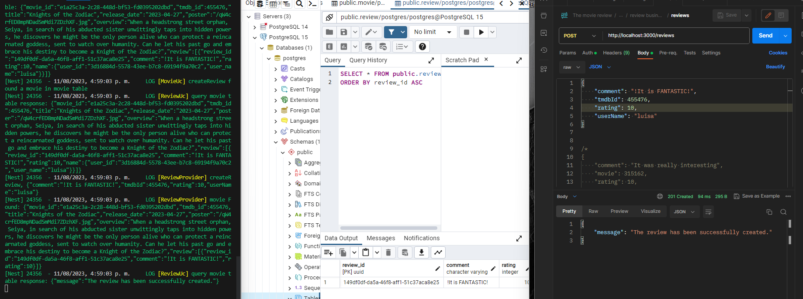
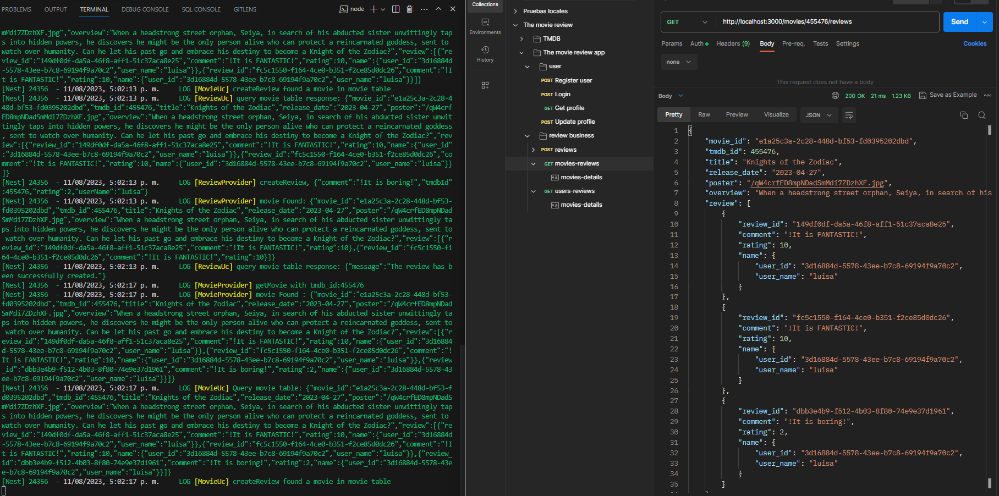
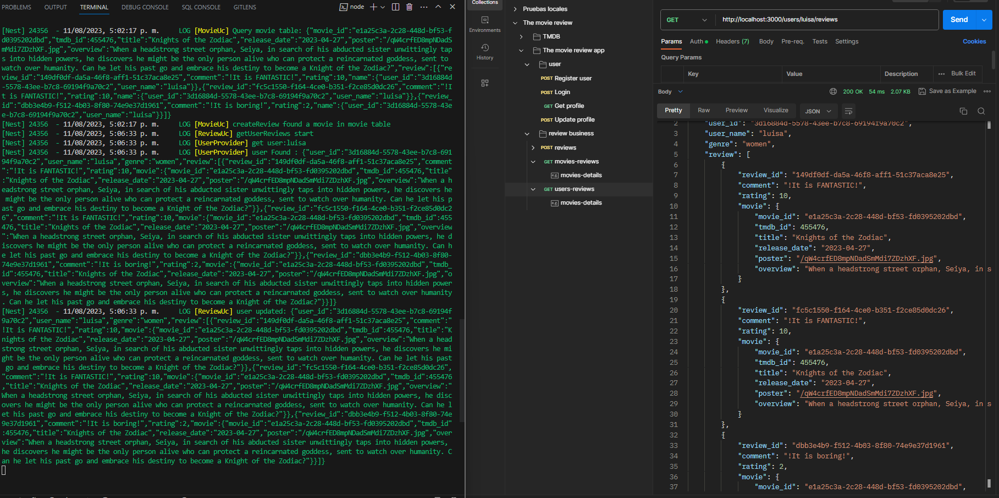

# Api the-movie-review
# Introduction 
TODO: API that allows users to submit movie reviews and fetch movie information from The Movie Database API. 

# Getting Started
TODO: Guide users through getting your code up and running on their own system. In this section you can talk about:
1.  create .env file and copy from .env.example y and set up with yor data
2.  Run with docker, run: docker-compose up
3.  Run wihout docker, Install package with: npm i or npm install
4.  Now run: npm run start

# Build and Test
TODO: Describe and show how to build your code and run the tests. 

# Contribute
TODO: Explain how other users and developers can contribute to make your code better. 

If you want to learn more about creating good readme files then refer the following [guidelines](https://docs.microsoft.com/en-us/azure/devops/repos/git/create-a-readme?view=azure-devops). You can also seek inspiration from the below readme files:
- [ASP.NET Core](https://github.com/aspnet/Home)
- [Visual Studio Code](https://github.com/Microsoft/vscode)
- [Chakra Core](https://github.com/Microsoft/ChakraCore)

# how does it work?
1.  Step 1: Register on the api the movie:

2.  Step 2: Login and generate jwt token

3.  Step 3: Generate a review

4.  Step 4: Fetch GET /movies/{tmdbId}/reviews

5.  Step 5: Fetch GET /users/{userName}/reviews

TODO: Tools implemented:
1. Nest v10
1.1.    Swagger
1.2.    Express
1.3.    Class validator
1.4     Typeorm     
2. Postgresql
3. Docker 
4. It was implemented the clean architecure

